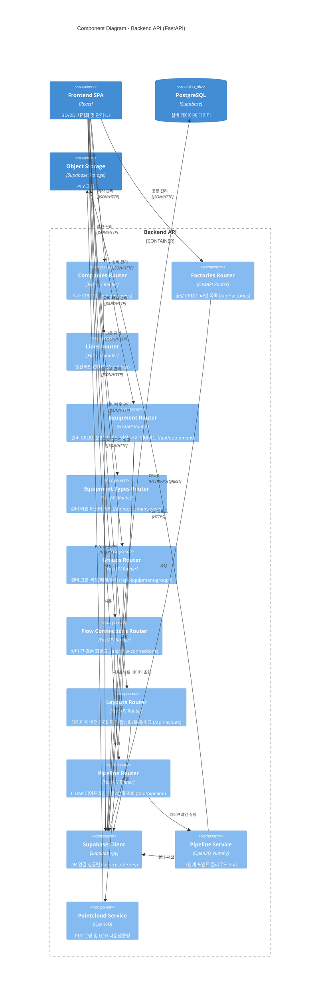

# C4 Level 3 - Component Diagram: Backend API

Backend API 컨테이너의 내부 컴포넌트 구성입니다.



## API 라우터 상세

| 라우터 | 주요 엔드포인트 | 설명 |
|--------|----------------|------|
| **Companies** | `GET/POST/PUT/DELETE /api/companies` | 회사 CRUD, 삭제 영향도 미리보기 |
| **Factories** | `GET/POST/PUT/DELETE /api/factories` | 공장 CRUD, 라인 목록 조회 |
| **Lines** | `GET/POST/PUT/DELETE /api/lines` | 생산라인 CRUD |
| **Equipment** | `GET/PATCH/POST/DELETE /api/equipment` | 설비 CRUD, 분할(split), 포인트 편집, 배치 업데이트 |
| **Equipment Types** | `GET/POST /api/equipment-types` | 설비 타입 마스터 데이터 관리 |
| **Groups** | `GET/POST/DELETE /api/equipment-groups` | 설비 그룹(BRIDGE/CLUSTER/FLOW) 생성·해제 |
| **Flow Connections** | `GET/POST/DELETE /api/flow-connections` | 설비 간 흐름 화살표 관리 |
| **Layouts** | `GET/POST/PUT/PATCH/DELETE /api/layouts` | 레이아웃 버전: 저장, 활성화, 복제, 비교 |
| **Pipeline** | `POST/GET /api/pipeline` | LiDAR 파이프라인 실행 및 진행률 폴링 |

## 서비스 컴포넌트

### Pipeline Service
```
pipeline.py (7-step orchestrator)
├── loaders.py      → E57/LAS/PLY 파일 로딩
├── filters.py      → 복셀 다운샘플링, 통계적 노이즈 제거
├── normalize.py    → 좌표 정규화 (원점 중심)
├── segment.py      → RANSAC 바닥 분리, DBSCAN 클러스터링
├── tagger.py       → 메타데이터 자동 생성 (ID, 바운딩박스)
├── exporter.py     → JSON 변환
└── upload_to_supabase.py → DB 삽입 + PLY 스토리지 업로드
```

### Pointcloud Service
- PLY 파일을 Supabase Storage에서 다운로드
- LOD(Level of Detail) 지원: high / medium / low
- 다운샘플링 후 [x, y, z, r, g, b] 배열로 반환
