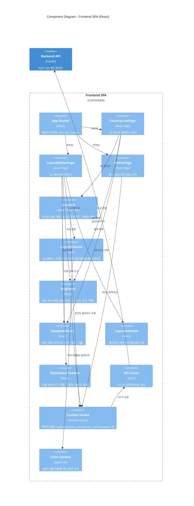

# C4 Level 3 - Component Diagram: Frontend SPA

Frontend SPA 컨테이너의 내부 컴포넌트 구성입니다.



## 페이지별 구성

### 3D 뷰어 (FactoryLinePage)
```
┌───────────┬────────────┬────────────────────────────────────┐
│ Companies │ Factories  │          Scene3D (Three.js)        │
│  Sidebar  │  & Lines   │  ┌──────────┐    ┌────────────┐   │
│           │  Sidebar   │  │Equipment │    │  RegPanel  │   │
│           │            │  │  List    │    │  (우측)     │   │
│           │            │  └──────────┘    └────────────┘   │
└───────────┴────────────┴────────────────────────────────────┘
```

- 박스 모드: 설비를 3D 박스로 렌더링
- 클라우드 모드: 실제 포인트 클라우드 데이터 렌더링 (LOD 지원)
- 설비 그룹: 반투명 바운딩박스로 시각화

### 2D 레이아웃 편집기 (LayoutEditorPage)
```
┌───────────┬────────────┬────────────────────────────────────┐
│ Companies │ Factories  │       LayoutCanvas (SVG)           │
│  Sidebar  │  & Lines   │  ┌──────────┐    ┌────────────┐   │
│           │  Sidebar   │  │Equipment │    │  RegPanel  │   │
│           │            │  │  List    │    │  (우측)     │   │
│           │            │  │          │    └────────────┘   │
│           │            │  └──────────┘                      │
│           │            │  [MultiSelectToolbar]              │
│           │            │  [LayoutSelector]                  │
└───────────┴────────────┴────────────────────────────────────┘
```

- 드래그로 설비 이동, 핸들로 리사이즈
- Shift+Click / 박스 선택으로 다중 선택
- 정렬 도구: 좌측/중앙/우측 정렬, 균등 배치, 그리드
- 플로우 화살표: 설비 간 자재 흐름 표시
- 레이아웃 버전: 저장/복제/비교/활성화
- 바닥 범위 설정 + 배경 이미지 오버레이

### 관리 페이지 (AdminPage)
```
┌──────────────┬──────────────┬──────────────┬──────────────┐
│  Companies   │  Factories   │    Lines     │  Equipment   │
│   + Layouts  │              │              │  (zone별)    │
└──────────────┴──────────────┴──────────────┴──────────────┘
```

- 4열 계층 CRUD 인터페이스
- 캐스케이드 삭제 미리보기
- 설비 타입 동적 추가
- Zone 아코디언 그룹화

## Custom Hooks 목록

| Hook | 역할 |
|------|------|
| `useCompanies()` | 전체 회사 목록 |
| `useCompanyFactories(code)` | 회사별 공장 목록 |
| `useFactoryLines(code)` | 공장별 라인 목록 |
| `useFactoryEquipment(code)` | 공장 전체 설비 |
| `useLineEquipment(code)` | 라인별 설비 |
| `useEquipmentGroups(line, factory)` | 설비 그룹 |
| `useFlowConnections(factory)` | 플로우 화살표 |
| `useLayouts(factoryId)` | 레이아웃 목록 |
| `useActiveLayout(factoryId)` | 활성 레이아웃 |
| `useLayoutMutations()` | 레이아웃 CRUD 뮤테이션 |
| `useCompanyMutations()` | 회사 CRUD 뮤테이션 |
| `useFactoryMutations()` | 공장 CRUD 뮤테이션 |
| `useLineMutations()` | 라인 CRUD 뮤테이션 |
| `useEquipmentMutations()` | 설비 CRUD 뮤테이션 |
