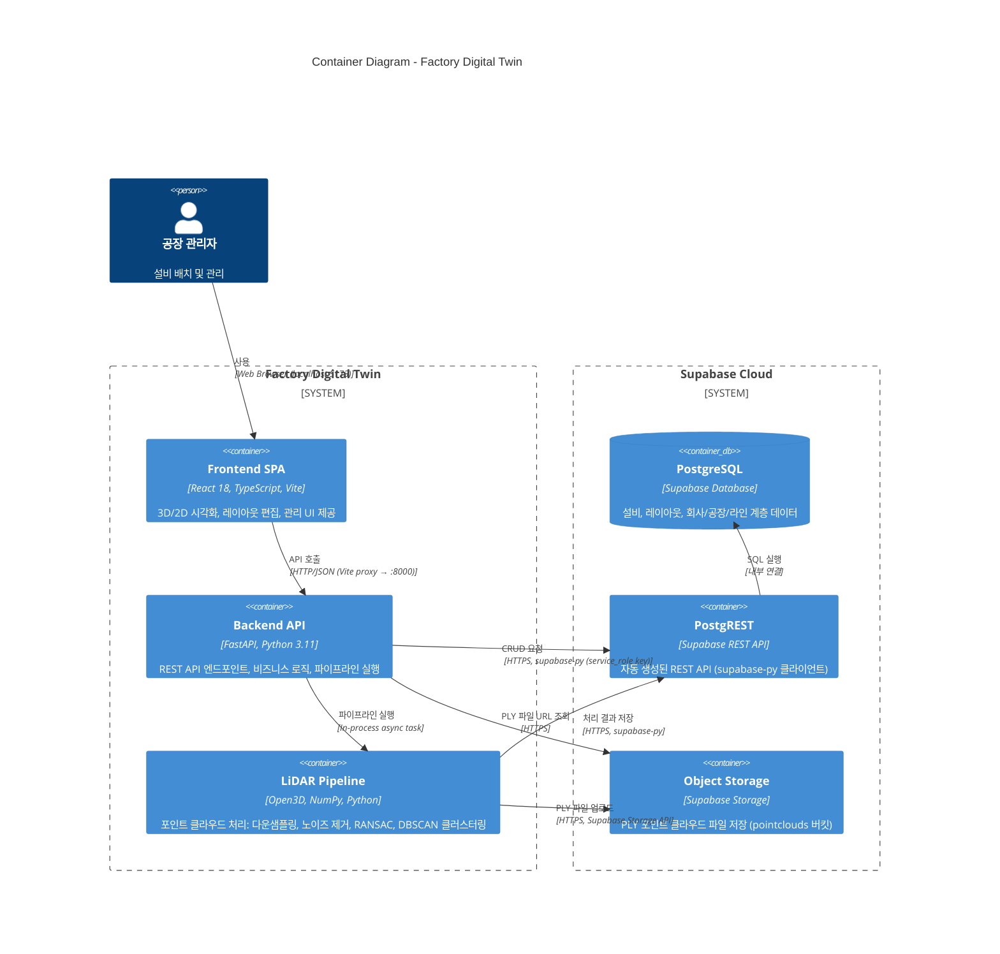

# C4 Level 2 - Container Diagram

Factory Digital Twin 시스템의 주요 컨테이너(배포 단위) 구성입니다.

## 컨테이너 상세

### Frontend SPA
| 항목 | 내용 |
|------|------|
| 기술 스택 | React 18, TypeScript, Vite, TanStack Query |
| 3D 렌더링 | React Three Fiber + Three.js + @react-three/drei |
| 2D 렌더링 | SVG 기반 LayoutCanvas (드래그/리사이즈/멀티셀렉트) |
| UI | Radix UI + Tailwind CSS |
| 상태 관리 | TanStack Query (서버 상태), React useState (로컬 상태) |
| 페이지 | 3D 뷰어, 2D 레이아웃 편집기, 관리(Admin) 페이지 |

### Backend API
| 항목 | 내용 |
|------|------|
| 프레임워크 | FastAPI (uvicorn) |
| 포트 | 8000 |
| 미들웨어 | CORS, GZip (1KB+) |
| 주요 라우터 | companies, factories, lines, equipment, equipment-types, equipment-groups, flow-connections, layouts, zones, pipeline |
| 인증 | Supabase service_role key (RLS bypass) |

### LiDAR Pipeline
| 항목 | 내용 |
|------|------|
| 실행 방식 | Backend API 프로세스 내 비동기 태스크 |
| 7단계 | 파일 로드 → 복셀 다운샘플링(5cm) → 노이즈 제거 → 좌표 정규화 → RANSAC 바닥 분리 → DBSCAN 클러스터링(30cm) → 메타데이터 태깅 |
| 입력 형식 | E57, LAS/LAZ, PLY |
| 출력 | equipment_scans 레코드 + 개별 PLY 파일 |
| 진행률 | In-memory 딕셔너리로 추적 (job_id 기반 폴링) |

### Supabase
| 서비스 | 용도 |
|--------|------|
| PostgreSQL | 모든 메타데이터 영구 저장 |
| PostgREST | REST API 자동 생성 (supabase-py 클라이언트가 사용) |
| Storage | PLY 바이너리 파일 저장 (pointclouds 버킷, public) |
