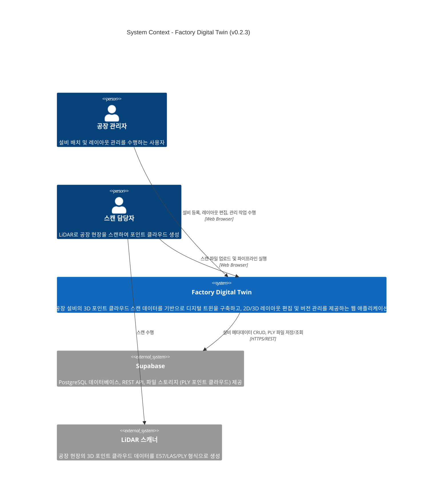

# C4 Level 1 - System Context Diagram

Factory Digital Twin 시스템의 최상위 컨텍스트 다이어그램입니다.

## 설명

| 요소 | 역할 |
|------|------|
| **공장 관리자** | 3D/2D 뷰어에서 설비 확인, 타입 지정, 레이아웃 편집, 그룹/플로우 관리 |
| **스캔 담당자** | LiDAR 장비로 공장을 스캔하고, 결과 파일을 시스템에 업로드 |
| **Factory Digital Twin** | 포인트 클라우드 처리 파이프라인 + 3D/2D 시각화 + 관리 기능 통합 시스템 |
| **Supabase** | 클라우드 호스팅 PostgreSQL + REST API + Object Storage (PLY 파일) |
| **LiDAR 스캐너** | Trimble, Leica 등 3D 스캔 장비 (E57/LAS/PLY 출력) |
