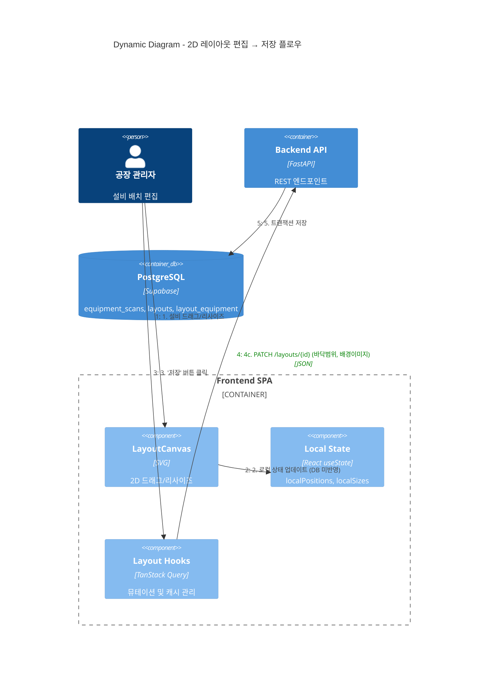

# C4 Dynamic Diagram - 2D 레이아웃 편집 및 저장 플로우

설비 배치 편집부터 레이아웃 버전 저장까지의 데이터 흐름입니다.



## 레이아웃 버전 관리 워크플로우

```
┌──────────────────────────────────────────────────────────┐
│                  레이아웃 버전 관리                        │
│                                                          │
│  [v1.0 초기배치]  →  [v1.1 라인A 재배치]  →  [v2.0 확장] │
│    (비활성)           (비활성)                (활성 ★)    │
│                                                          │
│  활성 레이아웃: 공장당 1개만 (DB 트리거로 강제)           │
│                                                          │
│  작업:                                                    │
│  ├── 저장: 현재 뷰어 상태를 새 레이아웃으로 저장          │
│  ├── 활성화: 특정 버전을 현재 활성으로 설정               │
│  ├── 복제: 기존 레이아웃을 복사하여 새 버전 생성          │
│  ├── 비교: 두 레이아웃 간 설비 위치 차이 비교             │
│  └── 삭제: 비활성 레이아웃 제거                           │
└──────────────────────────────────────────────────────────┘
```

## 로컬 상태 vs 서버 상태

| 구분 | 저장 위치 | 업데이트 시점 | 설명 |
|------|----------|-------------|------|
| `localPositions` | React state | 드래그할 때마다 | `{ "EQ_001": {x: 5.2, y: 10.3} }` |
| `localSizes` | React state | 리사이즈할 때마다 | `{ "EQ_001": {w: 2.0, d: 1.5} }` |
| `hasChanges` | React computed | 변경 감지 | 저장 버튼 활성화 조건 |
| `equipment_scans` | Supabase DB | 저장 클릭 시 | 설비 실제 위치 (source of truth) |
| `layout_equipment` | Supabase DB | 저장 클릭 시 | 레이아웃 버전별 위치 스냅샷 |
