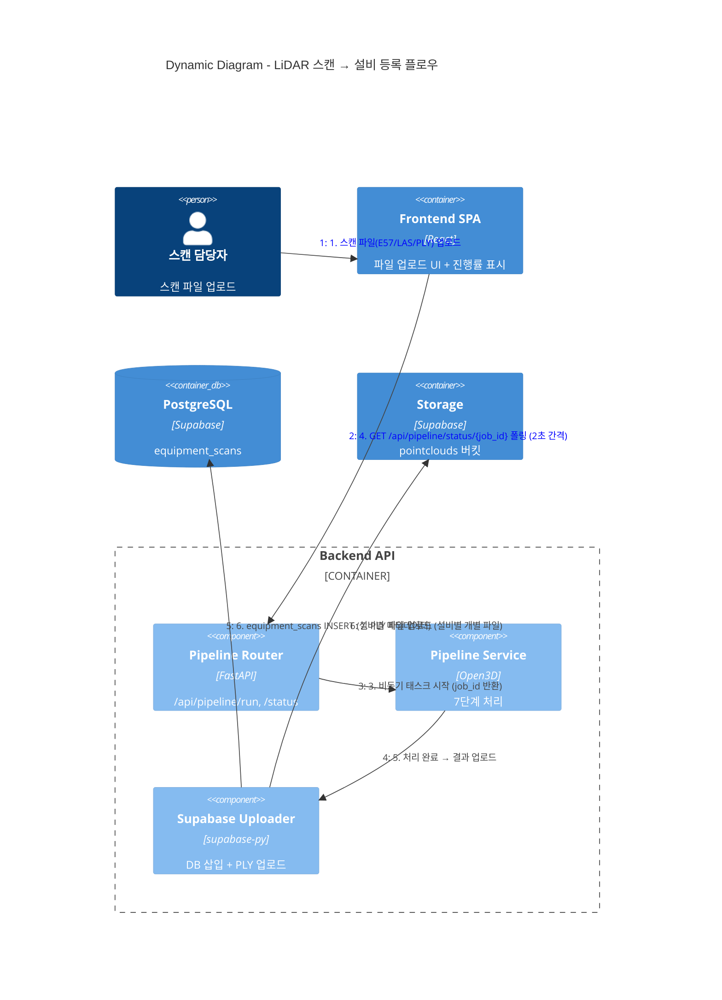

# C4 Dynamic Diagram - LiDAR 파이프라인 처리 플로우

스캔 파일 업로드부터 설비 등록까지의 데이터 흐름입니다.



## 파이프라인 7단계 상세

```
입력: 3D 스캔 파일 (E57/LAS/PLY, 수백만~수천만 포인트)
                    │
 Step 1 ────────────┤ 파일 로드 (pye57/laspy/Open3D)
                    │ → Open3D PointCloud 객체
                    │
 Step 2 ────────────┤ 복셀 다운샘플링 (voxel_size=5cm)
                    │ → 포인트 수 대폭 감소
                    │
 Step 3 ────────────┤ 통계적 노이즈 제거 (nb_neighbors=20, std_ratio=2.0)
                    │ → 이상치 포인트 제거
                    │
 Step 4 ────────────┤ 좌표 정규화 (원점 중심 이동)
                    │ → 상대 좌표계로 변환
                    │
 Step 5 ────────────┤ RANSAC 바닥 분리 (distance_threshold=2cm)
                    │ → 바닥 평면 제거, 설비 포인트만 추출
                    │
 Step 6 ────────────┤ DBSCAN 클러스터링 (eps=30cm, min_points=50)
                    │ → 개별 설비 클러스터로 분할
                    │
 Step 7 ────────────┤ 메타데이터 태깅
                    │ → scan_code, centroid(x,y,z), size(w,h,d), point_count
                    │
출력: equipment_scans 레코드 + 개별 PLY 파일 (Supabase)
```

## 진행률 추적

```
Frontend                    Backend (in-memory dict)
   │                              │
   │ POST /pipeline/run ────────→ │ job_id = "SITE_001_scan"
   │ ←─────── { job_id }         │ jobs[job_id] = { step: 0, total: 7 }
   │                              │
   │ GET /pipeline/status ──────→ │ Step 1 진행 중...
   │ ←── { step:1, pct:14% }     │
   │                              │
   │ GET /pipeline/status ──────→ │ Step 3 진행 중...
   │ ←── { step:3, pct:43% }     │
   │          ...                 │
   │ GET /pipeline/status ──────→ │ 완료!
   │ ←── { status:"done" }       │
```
